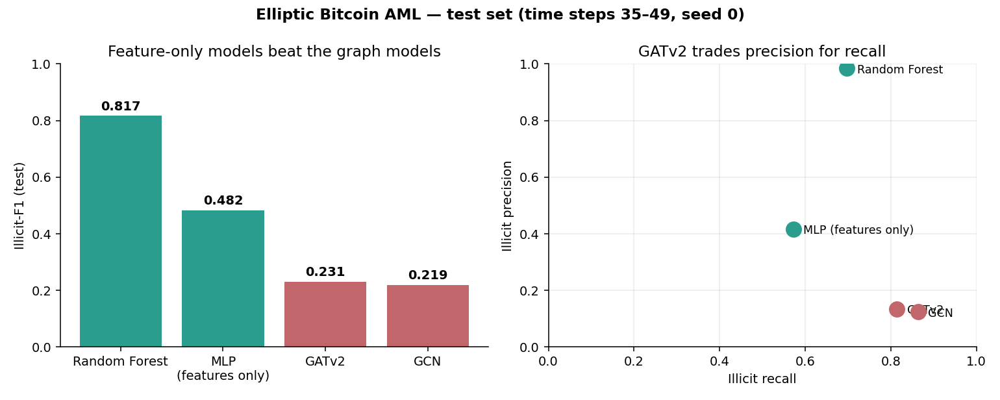
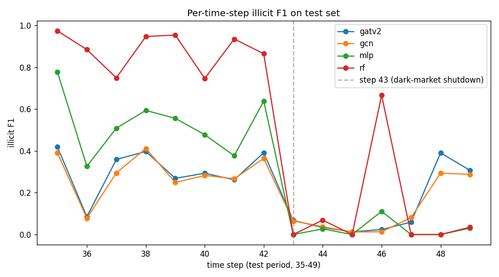
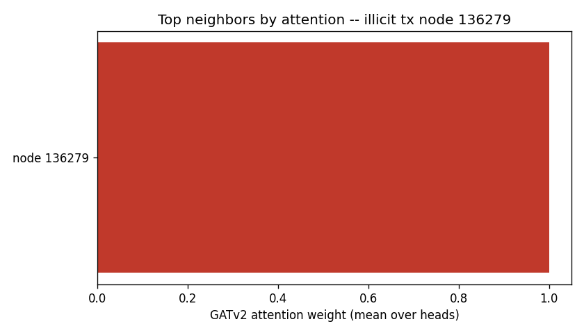
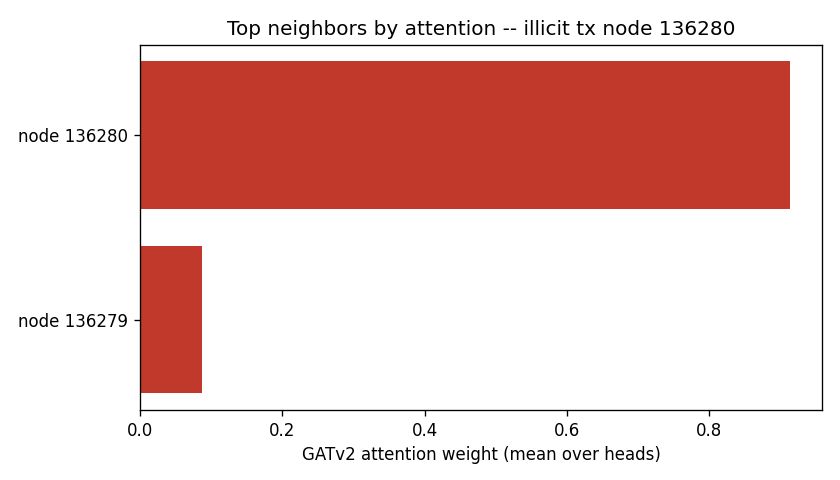
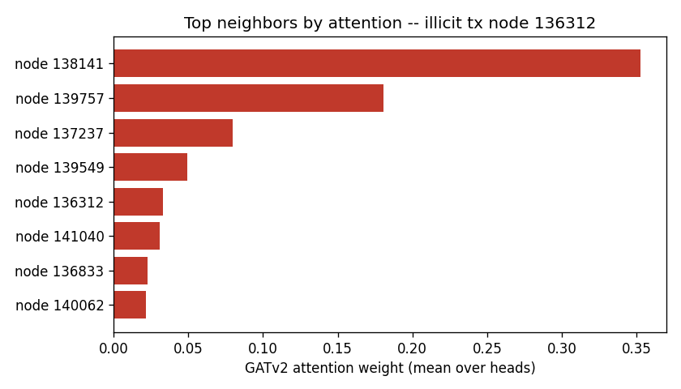

# Elliptic GATv2 AML Detector

[](https://github.com/siddharthgaur1)
[](https://github.com/siddharthgaur1/elliptic-gatv2-aml/actions/workflows/ci.yml)
[](LICENSE)




<sub>Regenerate with `python scripts/make_results_chart.py` — it reads `results/*_run.json`, so it cannot disagree with the table below.</sub>

Flagging illicit Bitcoin transactions on a 200k-node temporal graph with a
GATv2 network — benchmarked honestly against Random Forest, because on this
dataset the graph doesn't always win, and pretending otherwise is the easy
way to be wrong.

## Results (test set: time steps 35-49, seed 0)

All three neural models run with `--epochs 800` and early stopping
(patience 15) on a validation slice of **time steps 29-34** (see "Data and
label encoding"). Early stopping ends every run: GATv2 at epoch 24 (best 9),
GCN at 25 (best 10), MLP at 96 (best 81). No model is stopped by the epoch
budget.

| Model | Illicit-P | Illicit-R | Illicit-F1 | Macro-F1 |
|---|---|---|---|---|
| **Random Forest** | 0.9856 | 0.6971 | **0.8167** | 0.9029 |
| MLP (features only) | 0.4169 | 0.5725 | 0.4825 | 0.7196 |
| GATv2 | 0.1347 | 0.8144 | 0.2311 | 0.5014 |
| GCN | 0.1253 | 0.8633 | 0.2188 | 0.4747 |

Numbers are from the actual committed run: `results/metrics.json`,
`results/table.md`, `results/*_run.json` (one per model, with hyperparams,
seed, best epoch, and full training history). Nothing here is hand-typed
without a backing file.

**These numbers replaced a set that used a non-temporal validation slice.**
Until 2026-09-29 the "latest 15% of training nodes" used for early stopping
was chosen by sorting on `data.x[:, 0]`, on the belief that it was a
standardized time step. It is not: PyG drops the time-step column, and
`x[:, 0]` is an anonymised feature (correlation -0.026 with time). Validation
was therefore an arbitrary 15% of steps 1-34, not the latest steps. The test
set (PyG's own mask, steps 35-49) was never affected. Under the old slice the
seed-0 illicit-F1 was RF 0.8085, MLP 0.6558, GATv2 0.4266, GCN 0.4088.

What changed and why:

- **The neural models got much worse** (MLP 0.6558 → 0.4825, GATv2 0.4266 →
  0.2311, GCN 0.4088 → 0.2188). This is the split, not the machine: the
  pre-fix code, rerun on the same machine, reproduces the old MLP and GCN
  numbers exactly. With a genuinely later validation window, early stopping
  picks much earlier checkpoints (GATv2 best epoch 99 → 9, GCN 95 → 10).
- **Random Forest does not use the split at all.** It trains on
  fit ∪ val, which is the whole `train_mask` either way. Its seed-0 number
  moved (0.8085 → 0.8167) only because the old seed-0 forest was pickled with
  scikit-learn 1.9.0, and this run uses the pinned 1.8.0. The pre-fix code
  gives 0.8167 here too, and RF seeds 1-3 are bit-identical to before.
- **The ranking did not change:** Random Forest > MLP > both graph models, on
  every seed. The gap got wider.

### Seed variance (4 seeds)

`results/` is the canonical seed-0 run. Seeds 1–3 were re-run with the same
800-epoch budget and patience into `results/seeds/seed<N>/`, and
`python -m scripts.aggregate_seeds` combines all four into
`results/seeds/table.md` (mean ± sample std, read from each model's
`*_run.json`):

| Model | Illicit-P | Illicit-R | Illicit-F1 | Macro-F1 | Illicit-F1 per seed (0, 1, 2, 3) |
|---|---|---|---|---|---|
| **Random Forest** | 0.9868 ± 0.0010 | 0.6918 ± 0.0073 | **0.8134 ± 0.0049** | 0.9012 ± 0.0026 | 0.8167, 0.8184, 0.8105, 0.8081 |
| MLP (features only) | 0.3781 ± 0.0467 | 0.5552 ± 0.0551 | 0.4478 ± 0.0375 | 0.6995 ± 0.0216 | 0.4825, 0.4294, 0.4752, 0.4040 |
| GCN | 0.1365 ± 0.0083 | 0.8246 ± 0.0314 | 0.2340 ± 0.0112 | 0.5025 ± 0.0202 | 0.2188, 0.2415, 0.2433, 0.2325 |
| GATv2 | 0.1213 ± 0.0110 | 0.8800 ± 0.0446 | 0.2129 ± 0.0157 | 0.4596 ± 0.0338 | 0.2311, 0.1964, 0.2201, 0.2039 |

The ranking is not a seed-0 artifact: it holds on every seed individually.
Random Forest's worst seed (0.8081) beats the MLP's best (0.4825), and the
MLP's worst (0.4040) beats the best graph-model run (0.2433). Between the two
graph models the order is not stable: GATv2 edges GCN on seed 0, GCN is
ahead on seeds 1-3 and on the mean. Read them as tied.

On three of four seeds GATv2's validation illicit-F1 peaked at epoch 2 or 9
and patience 15 ended the run by epoch 24. On seed 2 it kept improving until
epoch 127 and ran 142 epochs (~37 min), and its test illicit-F1 (0.2201) was
no better than the short runs. Longer training did not help. Under the old,
non-temporal validation slice, the seed-2 graph runs were the ones that
stopped early. A fifth seed from the earlier round was killed when the
machine ran out of memory and is not included.

**Random Forest wins.** Not a typo, not a bug — see below.

## What the graph does and doesn't buy you

On Elliptic, a plain Random Forest over the 165 hand-engineered node
features (93 local, plus 72 aggregated features summarizing each
transaction's 1-hop neighborhood) beats every graph model here by a wide
margin, and also beats a features-only MLP. This is a known property of
this dataset, not an artifact of this repo: the feature set was
specifically engineered by Weber et al. to already encode a lot of local
graph structure, so a tree ensemble over those features gets most of the
graph's supervised signal "for free" without ever seeing an edge.

The committed Random Forest only partly bears that out. Its impurity-based
importances (`results/models/rf.joblib`, seed 0) put **22.5%** of the total
on the 72 aggregated features, which are 44% of the columns, and **none of
its ten most important features is aggregated**. The forest leans mostly on
the local features. Read that as "the neighborhood aggregates help, but they
are not where most of RF's edge comes from", not as proof in either
direction. Impurity importance is biased toward high-cardinality features,
and the aggregates are correlated with the local features they summarize.

The GNNs here (GATv2, GCN) underperform even the plain MLP baseline, which
means the message passing is actively hurting, not just failing to help.
Both fail the same way: **they over-flag.** Their recall is the highest of
any model here, above Random Forest's, and their precision is the lowest.

The confusion matrices (`results/metrics.json`, seed 0):

| Model | TP | FP | Nodes flagged | Recall | Precision |
|---|---|---|---|---|---|
| Random Forest | 755 | 11 | 766 | 0.6971 | 0.9856 |
| MLP | 620 | 867 | 1487 | 0.5725 | 0.4169 |
| GATv2 | 882 | 5668 | **6550** | 0.8144 | 0.1347 |
| GCN | 935 | 6530 | **7465** | **0.8633** | 0.1253 |

GATv2 flags 8.6× as many transactions as Random Forest to find 127 more true
illicit ones, at a cost of 5,657 extra false positives; GCN is worse still.
Message passing spreads the illicit signal *outward* onto the licit
neighbors of illicit nodes, so the models condemn whole neighborhoods. An
earlier version of this section, written against the old validation slice,
said GCN failed the opposite way (diluted signal, low recall). On the
current run that is no longer true: both graph models over-propagate.

The shared root cause is the class imbalance — illicit nodes are ~2% of the
graph — combined with early stopping on a later time window, which picks
checkpoints from the first 10 epochs, before the models have learned to be
selective.

For an AML use case the gap is concrete: GATv2 produces 6,550 alerts to catch
882 real cases, roughly 1-in-7 alert precision, against Random Forest's
nearly 99-in-100. That is the difference between a queue an analyst can work
and one they cannot.

A deeper hyperparameter search, an edge-dropout/graph-sampling scheme, or
GraphSAGE-style neighbor sampling might close some of this gap, but on the
run actually committed here, feature-only Random Forest is the honest state
of the art for this task.

**The gap is not undertraining.** On seed 2, GATv2's validation score kept
improving until epoch 127, and the run reached 0.2201 test illicit-F1, the
same range as the seeds that stopped by epoch 24. An earlier check under the
old validation slice (150 epochs, lr=0.005, patience 25) also found no gain
from longer training. The budget is not what holds GATv2 back.

### Per-time-step robustness



`results/figures/per_timestep_f1.png` plots illicit-F1 for each test time
step 35-49, grouping nodes by their real time step (read from the raw CSV;
see "Data and label encoding"). Random Forest holds 0.75-0.97 through step
42, and every model collapses at step 43, in line with the well-documented
dark-market shutdown around that step. After it, the per-step numbers rest
on very few illicit nodes (2 to 56 per step, versus 33 to 239 before), so
they are noisy. Random Forest stays near 0 for most of steps 43-49, apart
from 0.67 at step 46, which has only 2 illicit nodes. GATv2 and GCN recover
to ~0.3-0.4 at steps 48-49. Nothing here generalizes well past the shutdown.

### Attention inspection

<p float="left">
  
  
  
</p>

`results/figures/attention_node_*.png` show GATv2's last-layer attention
(averaged over 8 heads) over the 1-hop neighborhood of three correctly
flagged illicit test transactions, generated by `src/explain.py`. Attention
is not uniform — a small number of neighbors dominate the weighted sum for
each node. That does not buy GATv2 anything over GCN here: on the current
run GCN has the higher recall (0.86 vs 0.81) and the two are within noise on
illicit-F1. Concentrating attention is not the fix — the node's own 165 features
already separate the classes better than any neighborhood view of them does.

## Quickstart

See "Reproduce" below — `pip install -r requirements.txt`, then
`python -m scripts.run_all --epochs 800 --seed 0` trains all 4 models
(~10 min CPU for seed 0; early stopping ends every run well before 800) and writes
`results/`.

## Architecture

`scripts/inspect_data.py` confirms the label encoding and temporal split
empirically before anything trains. `src/data.py` builds the PyG data object
and the val/test split; `src/models.py` defines GATv2/GCN/MLP; `src/train.py`
runs the shared training loop (fixed seed, class-weighted loss) for all
three neural models, while `src/baselines.py` fits the Random Forest;
`src/evaluate.py` computes the shared metrics (precision/recall/F1, per-
time-step breakdown) for all four; `src/explain.py` generates the attention
figures from the committed GATv2 checkpoint. `scripts/run_all.py` wires all
of this into one command and writes everything under `results/`.

## Repository layout

```
src/        data loading, models (GATv2/GCN/MLP), training harness, RF
            baseline, evaluation utilities, attention explainability
scripts/    inspect_data.py (run first, drives label/split decisions below),
            run_all.py (trains all 4 models, writes results/)
app/        Streamlit demo — inspect any test-set node, its 1-hop
            neighborhood, GATv2 attention overlay, GATv2 vs RF comparison
results/    committed metrics.json, table.md, per-model run logs, trained
            models (results/models/*.pt, *.joblib), figures
```

## Limitations

- **No live deployment** — the Streamlit demo runs local-only against
  committed checkpoints; there's no hosted instance.
- **CPU-only training** — GATv2 is the slow model: ~6 min for seed 0 (24
  epochs), ~37 min for seed 2 (142 epochs); no GPU path is set up or
  benchmarked here.
- **Four seeds, and early stopping picks very early checkpoints** —
  `results/seeds/table.md` reports mean ± std over seeds 0–3 (see "Seed
  variance"), and the ranking holds on every seed. GCN's best validation epoch
  is 10 or earlier on all four seeds, GATv2's on three. A minimum-epoch floor or a
  different validation window might change the graph-model numbers; neither
  is tested here.
- **GATv2 underperforming here is dataset-specific**, not a general claim
  about GNNs vs. tree ensembles — see "What the graph does and doesn't buy
  you" above for why this dataset's features already encode local graph
  structure.

## Data and label encoding (empirically confirmed, not assumed)

Loaded via PyG's built-in loader — no manual CSV download:

```python
from torch_geometric.datasets import EllipticBitcoinDataset
dataset = EllipticBitcoinDataset(root="data/elliptic")
data = dataset[0]
```

Running `python scripts/inspect_data.py` prints, among other things:

- 203,769 nodes, 234,355 edges, 165 features per node.
- `y == 0`: 42,019 nodes — **licit**. `y == 1`: 4,545 nodes — **illicit**.
  `y == 2`: 157,205 nodes — **unknown** (unlabeled, excluded from
  loss/metrics but still present for message passing). Counts match Weber
  et al. (2019) exactly, confirming the encoding empirically rather than
  assuming it.
- `data.train_mask` / `data.test_mask` already exist and implement the
  canonical temporal split (train ⊆ steps 1-34, test ⊆ steps 35-49):
  29,894 / 16,670 labeled nodes respectively.
- **`data.x` does not contain the time step.** PyG 2.8 builds
  `x = feat_df.loc[:, 2:]`, dropping raw CSV column 0 (txId) and column 1
  (time step, 1..49). `x` equals raw columns 2-166 row for row, and `x[:, 0]`
  is an anonymised feature: 162,334 distinct values, correlation -0.026 with
  the time step. An earlier version of this README said the opposite (that
  `x[:, 0]` was a standardized time step); that was assumed, never checked,
  and wrong.

`src/data.py` reads the real time step back from the raw features CSV
(`data/elliptic/raw/elliptic_txs_features.csv`, column 1) into
`data.time_step`. PyG numbers nodes in CSV row order, and the load asserts
that the recovered steps reproduce PyG's own `train_mask` / `test_mask`
exactly, so a misaligned file fails loudly.

Validation slice for early stopping: the latest time steps of the training
range, cut on a whole-step boundary once they hold at least 15% of the
labeled training nodes. That is **steps 29-34** (4,687 nodes, 15.7%); the
models fit on steps 1-28 (25,207 nodes). PyG's canonical `test_mask` (steps
35-49) is left untouched as the test set.

### The anti-leakage invariant, and the bug testing it caught

Every number in the Results table depends on one property: **no node the model
fits on may postdate any node it validates on.** If that breaks, early stopping
is choosing a checkpoint using information from the future, and the illicit-F1
figures become interpolated rather than forward-looking.

That property was implemented and asserted nowhere. It was also *untestable* —
the logic sat inline in `load_data()`, behind an `EllipticBitcoinDataset()` call
that downloads 200k nodes. So it was extracted into a pure function,
`src/data.py:temporal_val_split(train_mask, time_col, val_fraction)`, and
`tests/test_data_split.py` asserts the invariant directly with no network and no
dataset:

```python
fit, val = temporal_val_split(train_mask, time_col, val_fraction=0.15)
assert time_col[fit].max() <= time_col[val].min()
```

A second test runs the same split with the time column shuffled against index
order, so a silent fallback to array position — the obvious way this breaks —
fails loudly.

**The extraction immediately surfaced a real bug.** The original computed:

```python
n_val = int(len(order) * val_fraction)
val_idx = train_idx[order[-n_val:]]   # temporally latest slice
fit_idx = train_idx[order[:-n_val]]   # remainder gets gradient updates
```

When `n_val == 0`, `order[-0:]` is **the entire array** and `order[:-0]` is
**empty** — the exact inverse of the intent. Every training node became
validation, none was fitted on, and training proceeded on an empty set without
raising anything. Unreachable at the committed `val_fraction=0.15` over ~30k
nodes; reachable by anyone lowering the fraction or running on a subset. It is
now an explicit branch with a test.

**The invariant held, and it was not enough.** The test above checks that
the split orders nodes by `time_col`. It said nothing about whether the
column passed in was time. `load_data` passed `x[:, 0]`, an anonymised
feature, so the "temporal" validation slice was an arbitrary one, and every
test stayed green. `tests/test_data_split.py` now also checks that the time
step comes from the raw CSV rather than `x[:, 0]`, that a misaligned CSV is
rejected, and that no time step is split between fit and validation. The
results above were retrained after the fix; see "Results" for what moved.

## Models

- **GATv2** (primary) — 2-layer `GATv2Conv`, 8 heads, dropout, ELU,
  final linear head to 2 logits. `return_attention_weights` is reachable
  (used by `src/explain.py`).
- **GCN** — `GCNConv` baseline, isolates the value of attention vs. plain
  neighborhood averaging.
- **MLP** — same 165 node features, no edges at all — isolates how much
  signal lives in the features alone.
- **Random Forest** (scikit-learn) — the honest non-graph yardstick,
  `class_weight="balanced"`.

All four share the same temporal train/val/test split and the same
evaluation code (`src/evaluate.py`). Class imbalance is handled with
inverse-frequency class-weighted cross-entropy for the neural models and
`class_weight="balanced"` for RF; no model is tuned on accuracy.

## Reproduce

```bash
pip install -r requirements.txt

# 1. Confirm label encoding / split empirically (prints the numbers above)
python scripts/inspect_data.py

# 2. Train all 4 models + write results/metrics.json, results/table.md,
#    figures (per-time-step F1 curve). ~10 min total on CPU for seed 0. The
#    budget is 800 but early stopping (patience 15) ends every run far
#    sooner — GATv2 at 24 epochs (~6 min, it is the slow one), GCN at 25
#    (~30 s), MLP at 96 (~1.5 min), RF in seconds.
python -m scripts.run_all --epochs 800 --seed 0

# 3. Attention inspection figures (uses the committed GATv2 weights)
python -m src.explain

# 4. Streamlit demo (loads committed trained models, does not retrain)
streamlit run app/app.py
```

Seed is fixed to `0` everywhere (`src/train.py::set_seed`, also passed
explicitly to `train_rf`). Hyperparameters and the exact epoch each model's
best checkpoint came from are logged in `results/<model>_run.json`.

Live demo: not currently deployed. Run `streamlit run app/app.py` locally
per the reproduce steps above — no API key or GPU required.

## CI

`.github/workflows/ci.yml` runs `ruff check` and a 2-epoch smoke test of
all three neural models on every push/PR, so a broken training loop or
import fails fast without needing a GPU runner.

## Dataset

[Elliptic Data Set](https://www.kaggle.com/ellipticco/elliptic-data-set) —
a public, anonymized graph of ~200k Bitcoin transactions, licit/illicit
labels on ~23% of nodes. Citation: Weber, M. et al. (2019), *"Anti-Money
Laundering in Bitcoin: Experimenting with Graph Convolutional Networks for
Financial Forensics"*, KDD 2019 Workshop on Anomaly Detection in Finance.
No proprietary data used anywhere in this repo.

## License

MIT — see [LICENSE](LICENSE).
